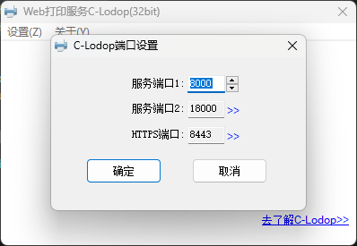

## clodop

clodop打印机插件，其他语法与官网一样，只是简化注册步骤。目前兼容最低版本：6.2.2.6

官网：http://www.c-lodop.com/LodopDemo.html

npm：https://www.npmjs.com/package/clodop


### vue 项目中使用
```
npm i clodop
```

```javascript
import { getLodop, initialize } from 'clodop'
// 初始化打印环境
initialize({
    token:"xxxxxx"
});

// 获取打印对象
const LODOP = getLodop();

if (LODOP) {
    // 使用打印功能
}
```

在main.ts 中初始化
```javascript
initialize({
    mainJS:'CLodopfuncs.js',
    wsPort1:8000,
    wsPort2:18000, 
    httpPort1:8000,
    httpPort2:18000,
    httpsPort:8443,
    token:"TOKEN"
})
```
| 参数名 | 默认值 | 说明 |
|----|----|----|
| mainJS | CLodopfuncs.js | 主进程文件名字 |
| wsPort1 | 8000 | 进程端口1 |
| wsPort2 | 18000 | 进程端口2 |
| httpPort1 | 8000 | http端口1 |
| httpPort2 | 18000 | http端口2 |
| httpsPort | 8443 | HTTPS端口 |
| token | `TOKEN` | 密钥 |

不同的token对应不同的ip/域名。   

 

 ## 使用示例
 ### 最简单打印示例

```javascript
const LODOP = getLodop()
const htmlstr = "<h1 style='color:red'> Lodop </h1>"
LODOP.PRINT_INIT(PrineCode) //任务号，随机生成即可
if (printerIndex) {
    //如果指定了打印机， 否则走电脑默认打印机
    LODOP.SET_PRINTER_INDEX(printerIndex)
}
LODOP.NewPage()
LODOP.SET_PRINT_STYLEA(0, 'ShowBarText', 2)
LODOP.ADD_PRINT_HTM('0mm', '0mm', '60mm', '35mm', htmlstr) // ADD_PRINT_TABLE(intTop,intLeft,intWidth,intHeight,strHtml)

LODOP.PRINT() //直接打印
// LODOP.PREVIEW() // 预览
```

### 获取打印机列表，指定打印机打印

```javascript
const LODOP = getLodop()
const printList = []
let printount = LODOP.GET_PRINTER_COUNT() //打印机总数
for (let index = 0; index < printount; index++) {
    const element = LODOP.GET_PRINTER_NAME(index) //根据索引获取打印机名字
    printList.push({
        label: element,
        value: index,
    })
}

console.log('当前打印机列表', printList)
```

```javascript
[
    {
        "label":"Zebra ZM400 (300 dpi) - ZPL",
        "value":0
    },
    {
        "label":"KONICA MINOLTA Universal PCL",
        "value":1
    }
]
```

#### 指定打印机打印

` LODOP.SET_PRINTER_INDEX(printerIndex)`  传入具体的索引即可
